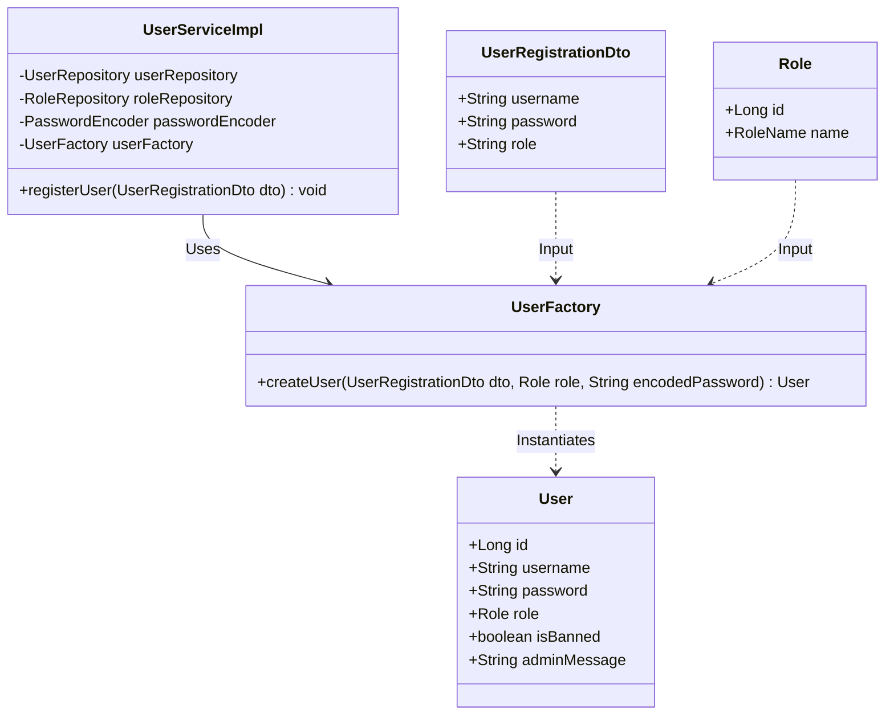
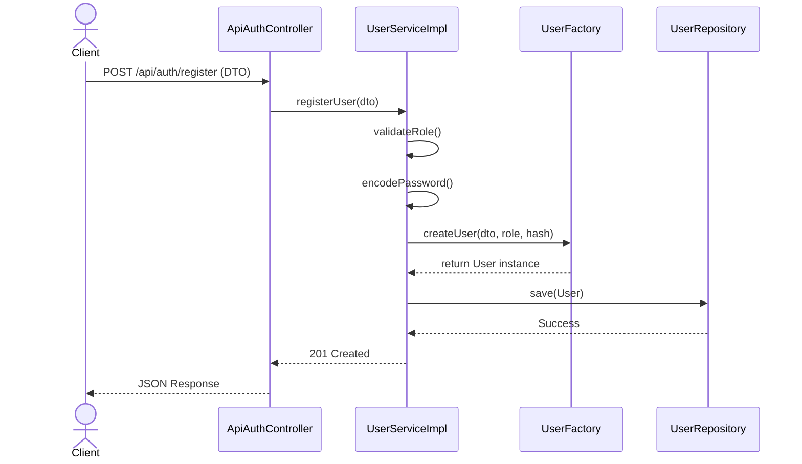

# 👥 Project Contributions

Our `MiniMarketPlace` project was developed with a strict 50/50 division of labor to ensure both contributors demonstrated a mastery of Spring Boot, API design, architectural patterns, and automated testing. Below is the detailed breakdown of responsibilities and technical implementations.

---

# 👨‍💻 Contributor: Mehedi Hasan Rabby (GitHub: Mehedi-86)

## 📌 1. Overview of Responsibilities
My primary responsibilities encompassed the foundational entity relationships, the authentication layer, administrative controls, design pattern implementation, and the complete CI/CD cloud deployment architecture.

**Branches Owned & Merged:**
* `feature/product-order-entities`
* `feature/product-service-controller`
* `feature/auth-service-controller`
* `feature/factory-pattern`
* `feature/admin-dashboard`
* `Mehediunittest`
* `MehediIntegrationtest`

## 🏗️ 2. Core Feature Implementation
### Authentication & Security Layer
* **`ApiAuthController`:** Engineered the RESTful endpoints for secure user registration and login.
* **Role-Based Access Control (RBAC):** Integrated strict role validation (`ROLE_ADMIN`, `ROLE_BUYER`, `ROLE_SELLER`) during the registration pipeline to ensure users cannot escalate privileges maliciously.

### Administrative Capabilities
* **`Admin Dashboard`:** Implemented features strictly accessible to authenticated administrators.
* **Ban Mechanism:** Engineered the `toggleBanStatus` logic allowing admins to instantly revoke malicious user access.
* **Messaging System:** Built a targeted messaging system allowing admins to dispatch warnings directly to specific users via `sendAdminMessage` and `clearAdminMessage`.

### Product & Order Data Modeling
* **Entity Relationships:** Designed the JPA/Hibernate ORM mappings for `Product` and `Order` entities, ensuring proper `@ManyToOne` and `@OneToMany` relations with the `User` entity (e.g., Sellers owning Products, Buyers owning Orders).

## 🎨 3. Design Pattern: Factory Method
To handle the complex instantiation of different user types (Admin, Buyer, Seller), I implemented the **Factory Creational Design Pattern**.

**Why Factory?** Directly instantiating the `User` object scattered validation and encoding logic across the application. The `UserFactory` centralizes creation, automatically securely hashing passwords via `PasswordEncoder`, attaching the correct `Role` entity, and setting default system states (e.g., `isBanned = false`).

### 📊 UML Class Diagram: User Factory Pattern

### 🔁 UML Sequence Diagram: Registration Flow

## 🧪 4. Testing & Quality Assurance
Adhering to strict Test-Driven standards, I authored exactly 50% of the project's testing suite, resulting in 100% CI pipeline success.

### Unit Testing (JUnit 5 & Mockito)
Authored **10 Unit Tests** focusing on the Service layer:
* **`UserServiceTest.java` (8 Tests):** Verified Factory Pattern instantiation, exception handling for missing roles, and Admin logic (banning/messaging). Used `@Mock` and `@InjectMocks` to simulate database interactions entirely in-memory.
* **`CustomUserDetailsServiceTest.java` (2 Tests):** Validated Spring Security's user loading mechanism and `UsernameNotFoundException` handling.

### Integration Testing (Spring Boot Test & MockMvc)
Authored **2 Integration Tests** utilizing an in-memory **H2 Database**:
* Configured `@ActiveProfiles("test")` and `@Transactional` to ensure a pristine database state per test.
* **Auth Controller Test:** Verified successful 201 HTTP status for user registration, actively bypassing Spring Security's CSRF protection using `.with(csrf())`.
* **Order Controller Test:** Simulated an authenticated session using `@WithMockUser` to test protected data retrieval.

## ☁️ 5. Cloud Architecture & Deployment
I was responsible for the transition from local development to production cloud infrastructure.
* **Database Provisioning:** Provisioned and secured a managed **PostgreSQL 16** instance on Render (Ohio, US East).
* **Web Service Deployment:** Deployed the Spring Boot application using Docker on Render.
* **Network Resolution:** Diagnosed and resolved cross-region network errors and JDBC URL formatting issues to successfully link the application layer to the database tier over the public internet using explicit credentials and environment variables.

---
